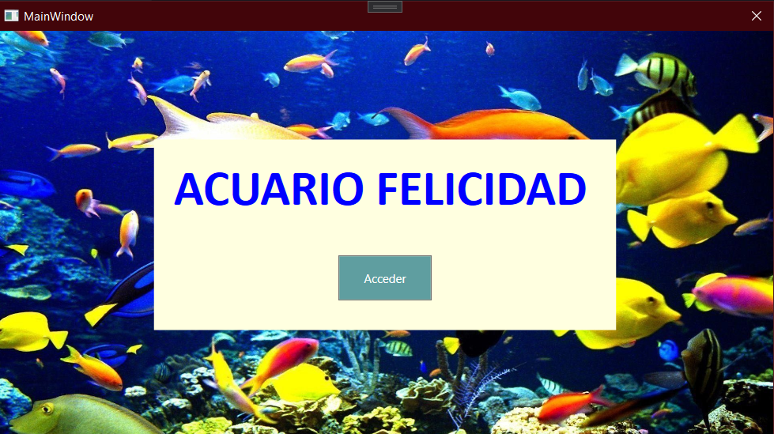
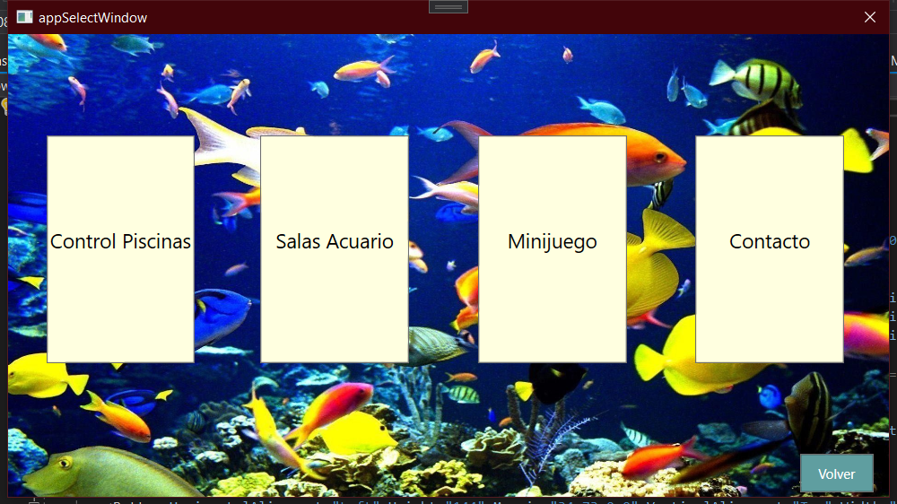
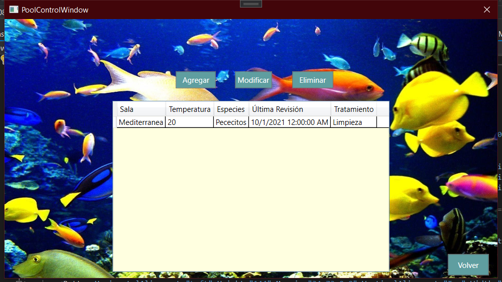
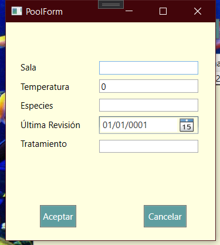
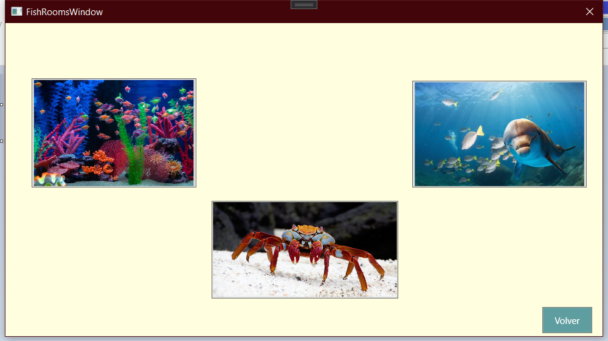

# Proyecto de WPF - XAML

En este proyecto desarrollamos una aplicación para un acuario ficticio. En el ejercicio se especificaban las vistas que debía implementar la aplicación.

- Una pantalla de bienvenida/incio, que lleve a la aplicación principal y tenga el nombre del acuario.
- Un menu con acceso a los diferentes apartados de la App:
  - Una vista con el control y administración de las piscinas del acuario en las diferentes salas
  - Una vista donde poder que salas tiene el acuario y una descripción de cada una.
  - Un pequeño minijuego relacionado con el acuario.
  - Un apartado de contacto donde poder dejar sugerencias, y con un mapa mostrando la ubicación del acuario

## Vista de inicio

Esta vista es lo primero que ve el usuario y solo tiene un botón que le da acceso al resto de la App. 

El botón, y otros con la misma funcionalidad funciona cerrando la vista XAML actual y creando y abriendo al que quiera redireccionar al usuario.

> new AppSelectWindow().Show();

> Close(); 

## Menu Principal

Desde esta vista elegimos a que parte de la App queremos acceder, con los cuatro botones centrales, donde esta la atención. Tambien a partir de ahora siempre tendremos un botón para volver a la vista anterior.
Y la implementación es igual que la del botón de la vista anterior.

## Control de Piscinas

Aqui simulamos el acceso que tendría un administrador del acuario que registraría información de revisiones en las piscinas de las salas de acuario. La vista es un CRUD donde podemos añadir, modificar y eliminar piscinas.
Para esto tenemos ya mas lógica por detras. Tenemos una clase _Pool_ que modela la información de una piscina, con las propiedades:
- Nombre de la sala
- Temperatura
- Especie
- Fecha de revisión
- Tratamiento

Y una clase _PoolController_ que funciona como controlador para acceder a la "base de datos", que en este caso no es mas que una colección en la propia clase del controlador.
Esta clase tiene los metodos para añadir, modificar y eliminar. que reciben un objecto de clase _Pool_ y hacen la operación pertinente en la colección interna del controldor.

En la clase de la propia ventana se injecta el controlador, y se hace un _Binding_ entre los datos del _DataGrid_ (la tabla de vista) y el objeto del controlador.
> poolGrid.DataContext = controller;

Los botones de modificar y añadir, despliegan un formulario con la información a rellenar de un objeto _Pool_:

En el _.cs_ de esta vista del formulario hacemos un _Binding_ entre los campos del formulario y las propiedades de un objeto _Pool_. Si estamos agregando lo asocia a una nueva instancia que luego añadimos a la lista mediante el controlador, y si hemos llegando haciendo click en modificar, usara el objeto _Pool_ asociado con esa fila de la tabla, rescatandolo de la "base de datos" primero a través del controlador.
Al pulsar el boton de aceptar se llama al controlador y se modifica/agrega la piscina.

De vuelta en la vista de control de piscinas, queda el botón de eliminar, que tambien llama al controlador para hacer la operación. 

### MVC
En esta parte de la aplicación es donde se aplica mas directamente el patrón MVC: **Modelo - Vista - Controlador**.

El modelo es la clase _Pool_, donde estructuramos como vamos a guardar los datos. En la clase del controlador hacemos todas las operaciones de comunicación entre el modelo y la interfaz, y la vista es la ventana donde vemos los datos ya ordenados y estilizados. con interactividad de cara al usuario.

## Salas del acuario

Tenemos tres botones con una imagen que representa la sala correspondiente. Al hacer click en cada imagen se muestra un texto oculto con información sobre la sala.

